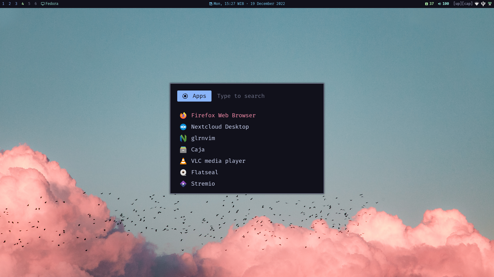

# My Dotfile

Run of the mill tiling window manager setup with status bar at the top.

    

- color scheme: [catppuccin](https://github.com/catppuccin/catppuccin) mocha flavor

- status bar: [Polybar](https://github.com/polybar/polybar/)

- menu launcher: [Rofi](https://github.com/davatorium/rofi/)

- sysfetch: [macchina](https://github.com/Macchina-CLI/macchina)

- idle manager: [xidlehook](https://github.com/jD91mZM2/xidlehook)

- wallpaper setter: [hsetroot](https://github.com/himdel/hsetroot)
  
  Wallpaper will randomly select file in `$HOME/Pictures/Wallpapers`

*My Neovim [configuration](https://github.com/GazDuckington/nvim).*

# Installation

*why? it's just my personal configuration*

1. install [Stow](https://github.com/aspiers/stow)

2. run `bash install.sh`
